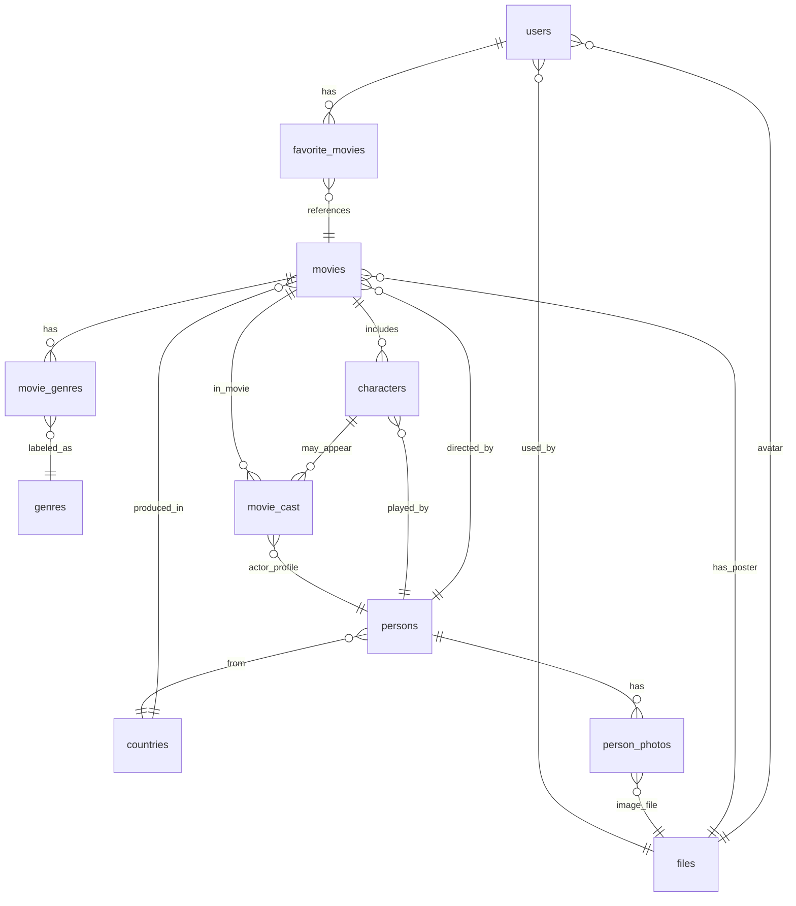

# Movie Application Database

This project defines a relational SQL database for a movie application. It includes the database schema, sample inserts, and a collection of complex queries.

## ER Diagram (Mermaid)

## Description of Entities

### Users
Stores user profile and authentication information, including optional avatar reference.

### Files
Stores metadata about externally hosted files such as avatars, posters, and photos.

### Countries
A lookup table for country names used by persons and movies.

### Persons
Represents people (actors, directors) with full name, biography, gender, and origin country.

### Person Photos
Stores multiple photos per person, with one marked as primary.

### Genres
A list of predefined genres such as Action, Drama, Comedy, etc.

### Movies
The central entity with information on title, description, release, budget, duration, etc. Linked to director, country, poster, and genres.

### Movie Genres
A many-to-many bridge table between movies and genres.

### Characters
Roles played in movies. May or may not be linked to a known actor.

### Movie Cast
A bridge for actors who appeared without defined characters (e.g., background roles).

### Favorite Movies
Bridge table to store users’ favorite movies.

## Files Included
- `schema.sql`: Full database structure
- `sample_insert.sql`: Data for testing
- `queries/`
  - `total_actor_budgets.sql`
  - `recent_movies_actors.sql`
  - `users_favorites.sql`
  - `directors_avg_budget.sql`
  - `filtered_movies.sql`
  - `movie_details_id.sql`

---

**Author**: Mykyta 
**DBMS**: MySQL 8+
